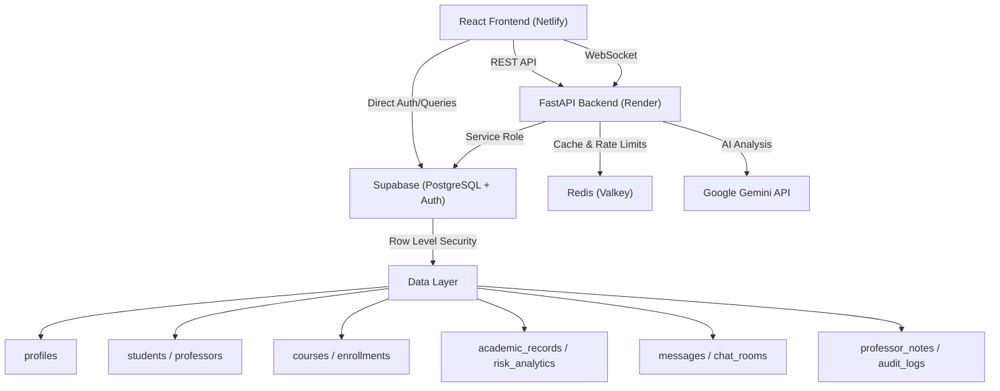

# 🎓 AI Student Success System

> A full-stack academic intelligence platform that fundamentally rethinks how universities support their students by combining AI-driven scheduling, predictive risk analytics, and mandatory professor-to-student care assignments.

---

## 📖 Why This Project Exists

This project was born out of real, lived experience as a student who is now graduating. Throughout my years at university, I personally felt the pain of problems that no existing university system even tries to solve:

**1. No Real Advisor for Life Balance.**
As a student working a part-time job, I desperately needed something — anything — to help me figure out how to split my time between classes, work shifts, studying, and actually living my life. Every semester felt like guessing. There was no tool that could look at my class schedule, my work hours, and my sleep needs, and tell me: *"Here's a realistic weekly plan that won't burn you out."*

**2. Blind Course Registration.**
Universities let students pick courses from a catalog with zero awareness of their actual academic background. If a student has been struggling with C Programming, they should **not** be blindly registering for an advanced Algorithms class. But nobody checks. Nobody warns them. Students just walk into failure.

**3. Professors Only See Exam Grades.**
In every university I've seen, professors interact with students through exactly two data points: the midterm grade and the final exam grade. They never know — and rarely ask — what's actually happening in a student's life. Are they missing classes because of a job? Are they failing because they never had the prerequisite knowledge? The grading system is completely disconnected from the human reality.

**4. Universities Lack Real Student Data.**
There is no structured system that tracks a student's study habits, absences, past failures, and risk factors in one place, and then *acts* on that data. It's all fragmented across different offices that never talk to each other.

### 💡 The Core Idea

This platform enforces a strict new paradigm: **the university must assign a dedicated professor (care provider) to each student, whose explicit responsibility is to monitor that student's academic health, intervene when risk factors appear, and communicate directly with them.**

It's not optional. It's not a suggestion box. It's a structured system where:
- Students input their real academic data (grades, absences, study time)
- The system algorithmically calculates risk levels
- Professors are assigned to monitor specific students
- Everyone communicates through a built-in real-time chat
- Administrators have full oversight and audit capabilities

---

## ✨ What Each Role Can Do

### 👨🎓 Student Portal

| Feature | Description |
|---|---|
| **Dashboard** | Overview of current GPA, credit progress, risk indicators, and academic status at a glance |
| **AI Smart Advisor** | Powered by Google Gemini — students input their semester courses with difficulty levels and target GPA. The AI analyzes feasibility, identifies weak areas based on prerequisite dependencies (e.g., flagging Algorithms if C Programming grades are low), generates focus priorities with recommended weekly hours, and produces a complete study strategy |
| **Time Planner & Scheduler** | Students input their class timetable, part-time work hours, sleep preferences, and study goals. The system generates an optimized weekly calendar with study blocks, work shifts, breaks, and sleep cycles — plus a burnout risk score and wellness index |
| **Academic Transcript & Grades** | Full CRUD management of academic records organized by semester (Freshman 1 through Senior 2+). Students can add, edit, and delete course records with scores, credit hours, study time, and absences. Auto-calculates cumulative GPA on a 4.5 scale with letter grades. Supports filtering by semester, category (Major, Liberal Arts, Double Major), and search |
| **Real-time Messaging** | WebSocket-powered chat with professors. Supports file attachments (images, documents), message editing (with 10-minute window), message deletion (with 10-second window), read receipts, and multi-line message editing |
| **Profile Management** | Edit personal details, university information, avatar, and account settings |
| **Action Plan** | View and track personalized improvement recommendations |

### 👨🏫 Professor / Care Provider Portal

| Feature | Description |
|---|---|
| **Professor Dashboard** | Overview of assigned courses, total students, and at-risk student counts |
| **My Classes** | View all assigned courses with semester filtering. Click into any class to see the full student roster |
| **Class Detail & Student Roster** | For each course: see every enrolled student's name, ID, CGPA, attendance percentage, and risk level. Sort by risk (highest first), GPA (lowest first), or attendance. Export the entire roster to CSV |
| **Student Deep Profile** | Click any student to see their complete academic history, per-course risk analytics with detailed risk reasons, all intervention notes written by professors, and AI-generated recommendations |
| **Intervention Notes** | Professors can write private intervention notes for any student in their class — documenting observations, concerns, or advice. These notes are timestamped and linked to specific courses |
| **AI Recommendation Generation** | One-click button to trigger Gemini AI analysis on a specific student's profile, generating personalized academic recommendations based on their grades, absences, and risk factors |
| **Direct Messaging** | One-click button to open a direct chat room with any student from the class roster |
| **Teaching Requests** | Professors can request to teach additional courses, which go through admin approval |

### 👨💻 Administrator Portal

| Feature | Description |
|---|---|
| **Admin Dashboard** | University-wide metrics: total students, total professors, high-risk student count, course failure rates, attendance averages |
| **User Management** | View all registered users (students, professors, admins) with role assignment capabilities |
| **Course Assignments** | The core administrative tool: strictly assign specific professors to specific courses for specific semesters. This is how the university enforces the care provider model |
| **Risk Overview** | University-wide view of all at-risk students across all departments. Each row shows the student's CGPA, risk level, and assigned care provider. Unattended students are flagged. Includes "Assign Provider" action buttons |
| **Chat History Audit** | Full administrative oversight of all messaging between students and professors. Messages are grouped by conversation with participant info, message counts, and warning flags. Admins can expand any conversation to read the complete chat transcript |
| **Teaching Approvals** | Review and approve/reject professor teaching requests for courses |

---

## 🧮 The Student Risk Algorithm

The system runs a custom-built prediction algorithm ([student_algorithm.py](file:///Users/test/Desktop/ai-student-success-system/backend/app/services/student_algorithm.py)) that calculates student risk from real behavioral data:

**Inputs:** First-term grade (G1), second-term grade (G2), weekly study time, past failure count, total absences

**Process:**
1. **Behavior Penalty Calculation** — Absences, failures, and low study time contribute to a penalty factor (0–30%)
2. **Grade Prediction (G3)** — Weighted average of G1 (30%) and G2 (70%), reduced by the behavior penalty
3. **Risk Score (0–100)** — Composite score from grade averages, failure history, absence count, and study habits
4. **Risk Classification** — High Risk (score ≥65 or predicted GPA <2.0), Medium Risk (score ≥35 or GPA <2.5), Low Risk (otherwise)
5. **Automated Recommendations** — Context-aware suggestions generated based on the specific risk factors detected

---

## 🏗 Engineering Design Process

This project followed a structured engineering lifecycle:

```
Problem → Need → Requirements → Concept Generation → Concept Evaluation
→ Design → Modeling & Simulation → Prototyping → Testing
→ Validation / Verification / Evaluation → Optimization
```

### 1. Problem Identification
Students fail or burn out due to poor time management, mismatched course selection, and zero proactive faculty support. Universities grade students on exams but never investigate *why* students struggle.

### 2. Need Statement
A unified platform that tracks real student data (grades, absences, study habits), intelligently advises students on scheduling and course selection, and forces structured accountability between professors and students.

### 3. Requirements
- Role-based access (Student, Professor, Admin) with distinct dashboards
- Real-time WebSocket messaging between students and professors
- AI-powered academic analysis and schedule generation
- Algorithmic risk calculation from behavioral data
- Administrative tools for provider assignment and chat auditing
- Full academic transcript management with GPA computation

### 4. Concept Generation

| Concept | Description | Verdict |
|---|---|---|
| **Concept 1** | Simple Q&A forum for students to ask questions | ❌ Not proactive — waits for students to seek help |
| **Concept 2** | Standalone AI schedule-maker tool | ❌ Lacks human faculty intervention |
| **Concept 3** | Analytics dashboard for professors only | ❌ Ignores the student's direct needs and agency |
| **Concept 4** | Unified ecosystem combining AI scheduling + predictive risk analytics + mandatory professor–student chat + admin oversight | ✅ Selected |

### 5. Concept Evaluation
Concept 4 was selected because it uniquely bridges automated data analytics (AI scheduling, algorithmic risk flagging) with necessary human empathy (direct messaging, intervention notes, care provider assignment). No single approach solves the problem alone.

### 6. System Architecture & Design



**Frontend:** React 18 + Vite + TypeScript with a premium glassmorphism design system, Framer Motion animations, and lazy-loaded route chunks.

**Backend:** Python FastAPI handling REST endpoints, WebSocket connections for real-time chat, and the student risk prediction algorithm.

**Database:** Supabase (PostgreSQL) with strict Row Level Security (RLS) policies, enforcing data isolation between roles.

**AI Layer:** Google Gemini API for academic goal analysis, schedule generation, and student recommendation generation.

### 7. Modeling & Simulation
- Designed the complete database schema ([schema.sql](file:///Users/test/Desktop/ai-student-success-system/schema.sql)) with foreign key chains enforcing: `Admin → assigns Professor → monitors Student`
- Simulated university populations with seed scripts to validate data relationships at scale
- Modeled the risk algorithm with varying inputs to calibrate penalty thresholds

### 8. Prototyping
- Built the core MVP: authentication system, three distinct role-based dashboards, and the WebSocket chat engine
- Implemented the admin provider-assignment workflow end-to-end
- Created the AI Advisor and Time Planner interfaces with Gemini integration

### 9. Testing
- Seeded mock university data (professors, students, courses, grades, enrollments) using automated scripts
- Tested WebSocket messaging under concurrent connections
- Validated RLS policies to ensure students cannot access other students' private grades

### 10. Validation, Verification & Evaluation
- **Validation:** Confirmed the system meets original requirements — professors can view at-risk students, message them, and write intervention notes
- **Verification:** Ensured the risk algorithm produces correct classifications against known test cases
- **Evaluation:** Reviewed UX with the full student-professor-admin workflow to confirm usability

### 11. Optimization
- Replaced polling with WebSockets for instant chat delivery
- Implemented lazy-loading for all page routes to minimize initial bundle size
- Added auto-expanding textareas and keyboard shortcuts for chat UX
- Secured the entire codebase by migrating hardcoded API keys to environment variables
- Added a Global Error Boundary to gracefully handle runtime crashes

---

## 💻 Tech Stack

| Layer | Technology |
|---|---|
| Frontend | React 18, TypeScript, Vite, TailwindCSS, Framer Motion, Lucide Icons |
| Backend | Python 3.9+, FastAPI, WebSockets |
| Database & Auth | Supabase (PostgreSQL), JWT, Row Level Security |
| Cache & Rate Limiting | Redis (Valkey) |
| AI | Google Gemini API |
| State Management | Zustand + TanStack React Query |
| Testing | Vitest, React Testing Library (Frontend), Pytest (Backend) |
| Deployment | Docker, Netlify (Frontend), Render (Backend & Cache) |

---

## 🚀 Production Deployment

The system is designed for a modern split-stack deployment:

**1. Frontend (Netlify)**
- Hosted as a static React SPA on Netlify for global edge delivery.
- Client-side routing managed via `netlify.toml`.
- Requires environment variables: `VITE_API_URL` (pointing to your Render backend), `VITE_SUPABASE_URL`, and `VITE_SUPABASE_ANON_KEY`.

**2. Backend & Cache (Render)**
- Hosted as a Web Service on Render (Gunicorn + Uvicorn async workers).
- Redis Cache hosted on Render Key Value (Valkey) for fast rate-limiting and AI response caching.
- Easy 1-click deployment using the included `render.yaml` Blueprint.

**3. Database & Auth (Supabase)**
- Hosted on Supabase Cloud.
- Handles PostgreSQL storage, JWT authentication, and Row Level Security (RLS).

---

## 🛠 Local Setup

### 1. Environment Variables
Create a `.env` file in the project root (**do not commit this file**):

```env
# Supabase
VITE_SUPABASE_URL=your_supabase_url
VITE_SUPABASE_ANON_KEY=your_anon_key
SUPABASE_URL=your_supabase_url
SUPABASE_ANON_KEY=your_anon_key
SUPABASE_SERVICE_ROLE_KEY=your_service_role_key
SUPABASE_JWT_SECRET=your_jwt_secret

# AI
GEMINI_API_KEY=your_gemini_api_key

# API
VITE_API_URL=http://localhost:8000/api
```

### 2. Frontend
```bash
npm install
npm run dev
```

### 3. Backend
```bash
cd backend
python3 -m venv .venv
source .venv/bin/activate
pip install -r requirements.txt
uvicorn app.main:app --reload --port 8000
```

### 4. Database
Run the SQL from `schema.sql` in your Supabase SQL editor, then seed with:
```bash
python seed_production.py
```

---

## 🔒 Security
- All API keys loaded from environment variables via `os.getenv()` and `import.meta.env`
- `.env` files, `backend/.venv/`, and `__pycache__/` are gitignored
- Supabase Row Level Security enforces data isolation per user role
- JWT authentication on all protected API endpoints
- Global Error Boundary prevents raw error exposure to end users
